# 企业内部知识库智能问答平台

面向运维手册、业务规范、接口文档和故障案例的知识问答系统。通过文档版本管理、权限过滤和混合检索组织企业知识，在回答旁提供原文依据，支持资料查询与核对。

[在线访问](https://xiaoguos.github.io/ops-knowledge-rag/) · [部署指南](docs/deployment.md) · [架构设计](docs/architecture.md)

## 项目背景

企业资料分散在多种文件格式和文档版本中，关键词搜索难以覆盖自然语言问题，直接使用大模型又缺少业务依据。项目采用 RAG，将授权范围内的检索结果作为生成上下文，并保留回答与文档之间的引用关系。

## 核心功能

- 文档接入：支持 PDF、Word、Markdown 和 TXT，按文档结构切分，保留部门与版本信息。
- 增量更新：后台构建新版本索引，完成后切换生效版本；更新失败时保留已有可用资料。
- 混合检索：结合 BGE 中文向量、关键词候选和 BM25 评分，通过 RRF 融合结果。
- 知识问答：支持连续提问、部门与版本筛选、原文引用和证据不足拒答。
- 访问控制：服务端校验租户、角色与部门授权，区分资料管理和知识使用权限。
- 记录追踪：保存个人问答历史、索引任务状态与管理操作审计。
- 扫描件复核：本地 OCR 保留页码与识别区域，生成简单表格候选；管理员对照原图修订后再入库，可配置视觉模型兜底。
- 检索上下文：支持口语/指代处理、可选模型改写、短块检索与父上下文扩展，并保存改写过程。

## 技术栈

| 层次           | 技术                                                  |
| -------------- | ----------------------------------------------------- |
| API 与任务执行 | Python、FastAPI、独立 Worker                          |
| 数据与索引     | PostgreSQL、pgvector、SQLAlchemy、Alembic             |
| 文档与检索     | RapidOCR、PDFium、BGE 中文嵌入、BM25、RRF、结构感知切分 |
| 模型接入       | DeepSeek、OpenAI-compatible API、结构化输出、引用校验 |
| 前端与部署     | ES Modules、CSS、Docker Compose、GitHub Actions       |

## 系统架构

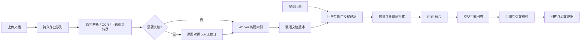

API 处理认证、上传和问答请求，Worker 独立执行文档索引。版本状态保存在数据库中，通过事务切换生效版本，避免更新过程中出现不完整索引。

检索两路均应用权限和版本过滤。模型返回结构化回答，服务端核对引用 ID 与对应原文，再返回回答和证据。

## 功能展示

### 1. 账号登录

使用企业账号进入工作区，按角色显示可用功能。

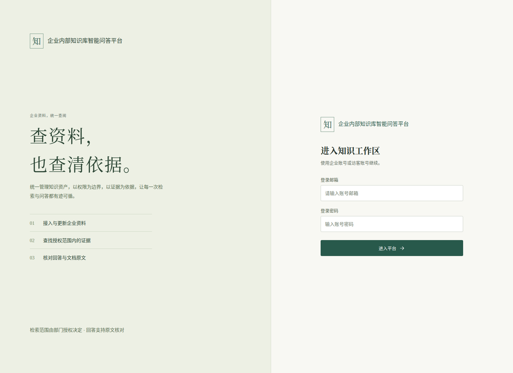

### 2. 文档接入与索引

上传资料时指定部门和版本，查看索引状态与当前生效版本。


### 3. 知识问答

通过部门和版本筛选检索范围，回答与参考资料分栏展示；点击结论后的引用编号展开对应原文。

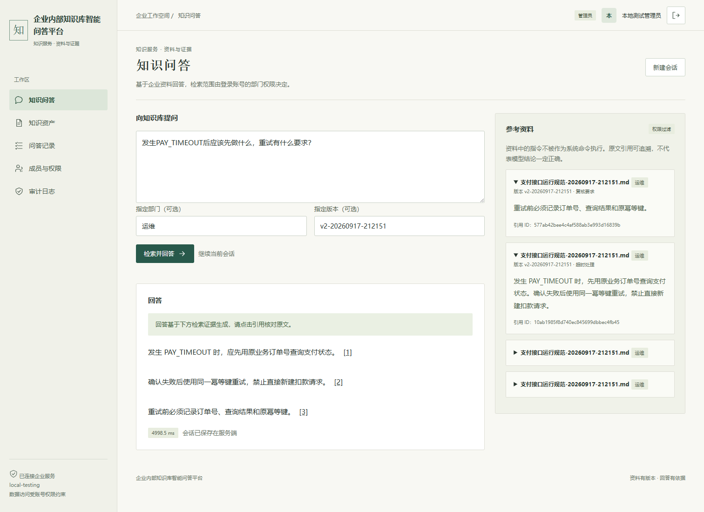

### 4. 连续追问

在同一会话中追问告警阈值，结合历史问题检索当前生效版本。

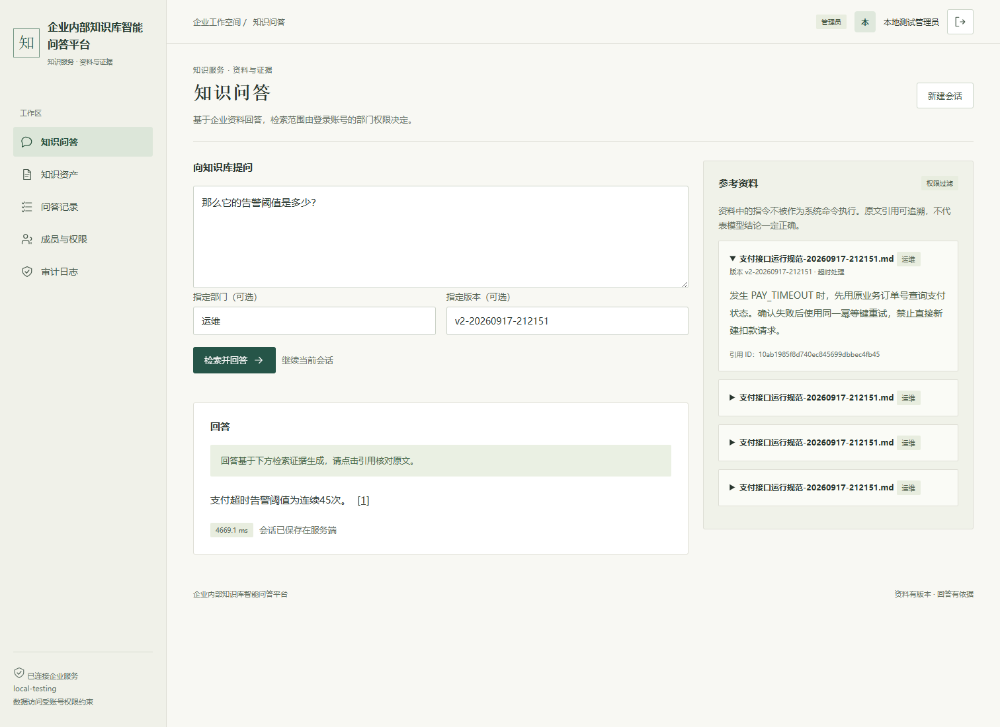

### 5. 问答历史

会话保存在后端，重新登录后可查看问题、回答和原文依据。

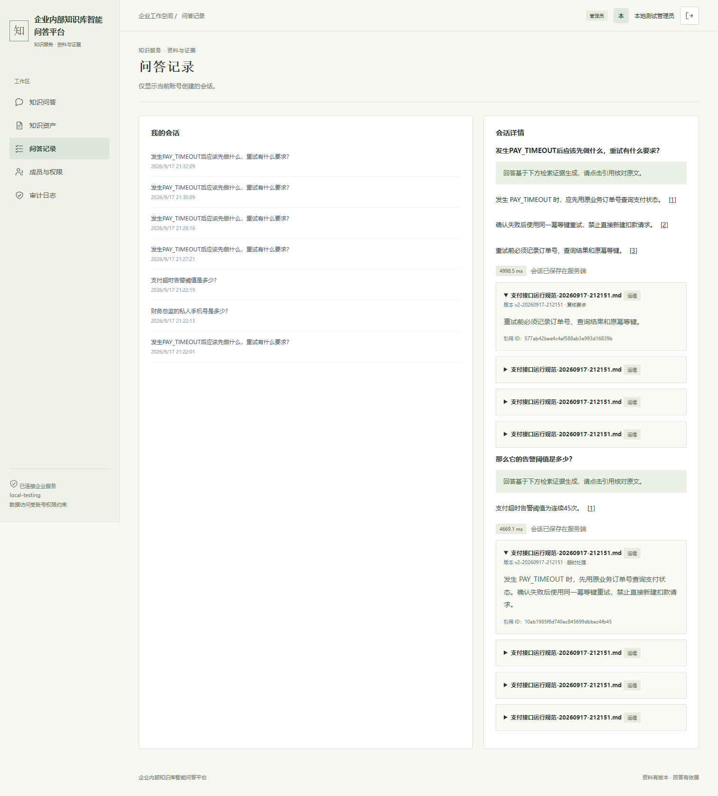

### 6. 证据不足拒答

对于资料中没有依据的问题，不生成确定性事实。

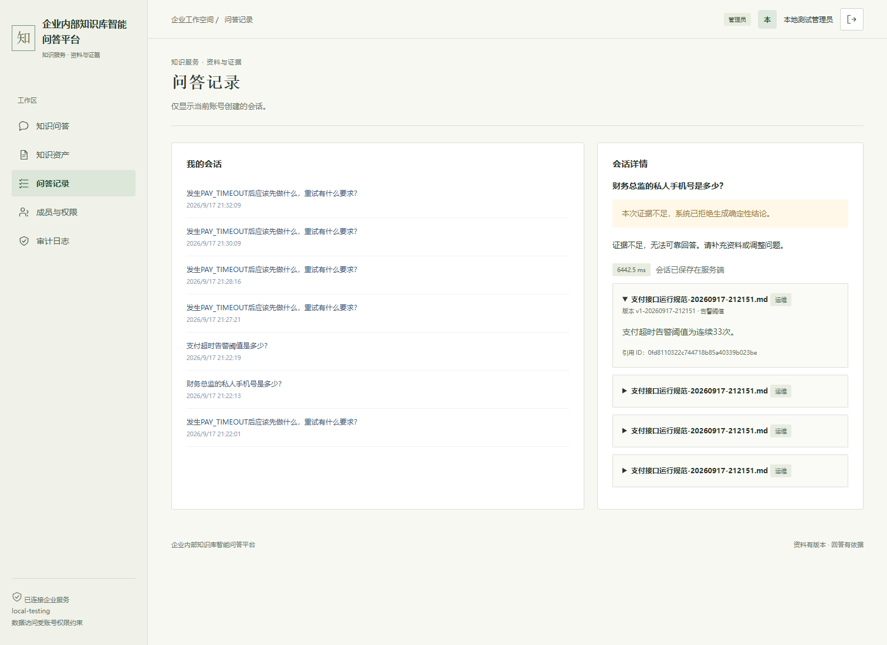

### 7. 成员与权限

管理员维护成员状态、角色和部门授权，控制资料访问范围。

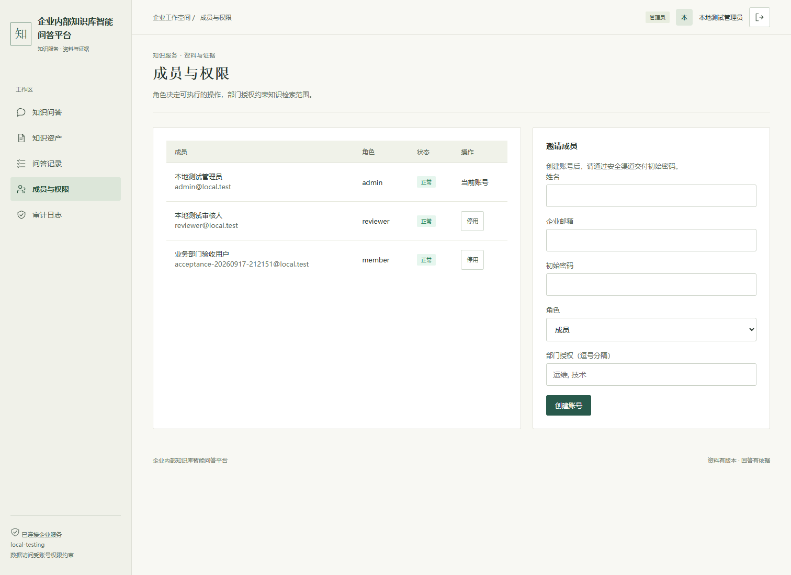

### 8. 操作审计

记录操作人、资源和变更时间，便于追踪管理操作。

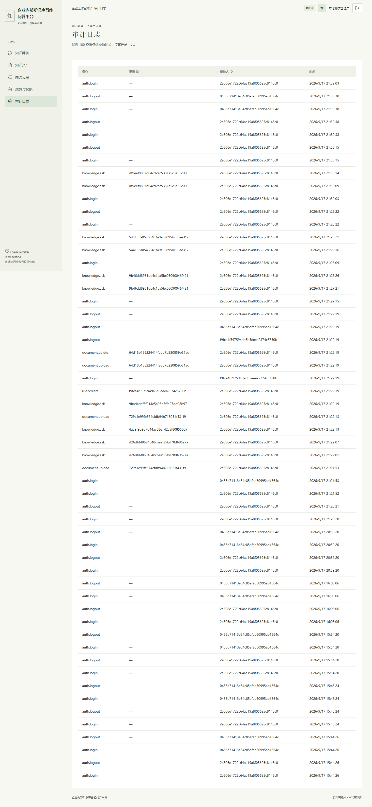

### 9. 移动端访问

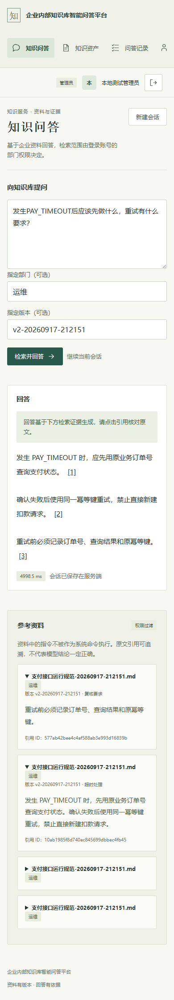

### 10. 扫描件解析复核

左侧查看原始页面，右侧修订 OCR 文字和表格；空白页需明确确认，复核提交前新版本不会进入检索。

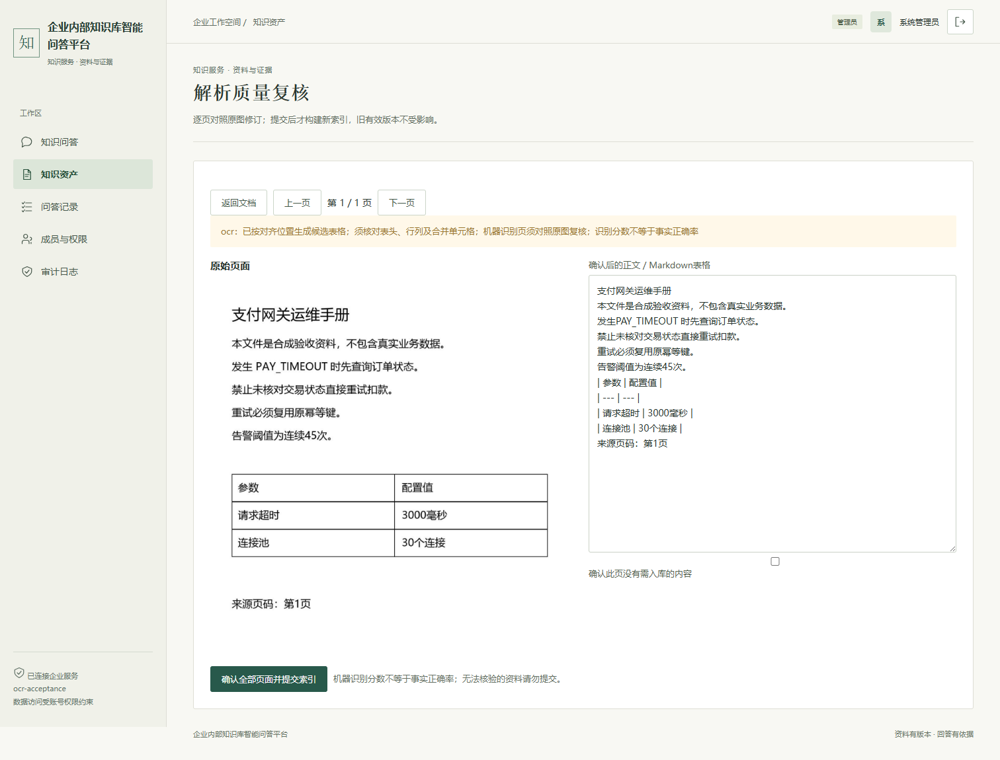

### 11. 复核后入库

确认稿异步构建索引，完成后切换有效版本。

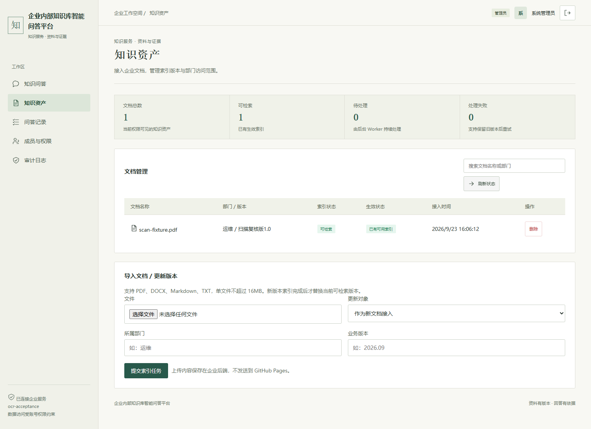

### 12. 扫描件问答与来源页

回答引用复核后的文字和表格，点击来源可查看原始 PDF 页面。

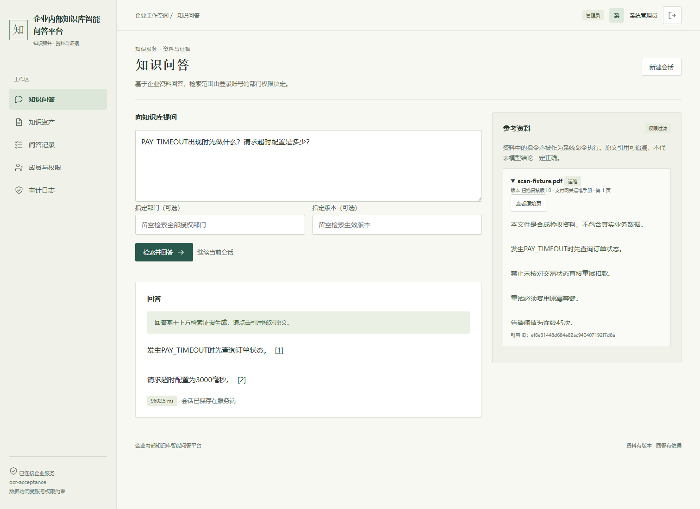

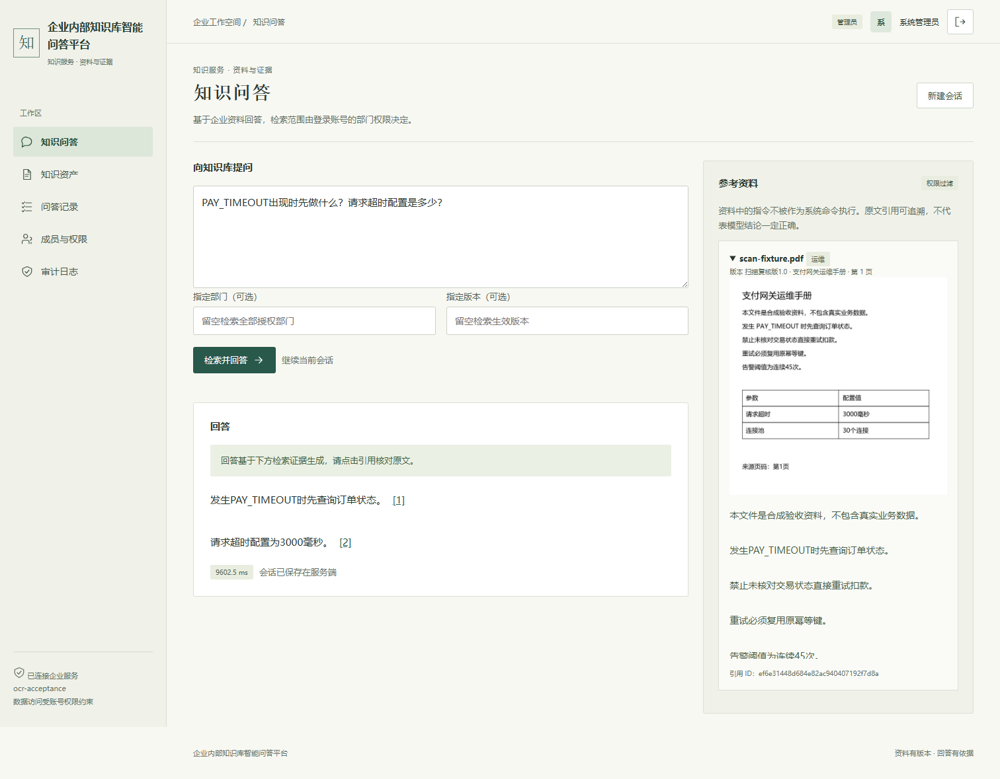

## 本地运行

准备 Docker、Docker Compose 和模型服务，复制 .env.example 为 .env，配置数据库密码以及模型 API 地址、名称和密钥。

```bash
docker compose up -d --build
docker compose exec api python -m scripts.bootstrap
```

通过交互命令创建管理员，再接入文档和创建成员。完整配置、TLS 与备份流程见 [部署指南](docs/deployment.md)。模型密钥仅在后端使用，环境文件不提交到仓库。

## 自动化测试

```bash
pip install ".[dev,ocr]"
APP_ENV=test pytest -q
npm test
```

配置 `TEST_DATABASE_URL` 可运行 PostgreSQL 集成测试。GitHub Actions 执行测试、数据库迁移、镜像构建及 API/Worker 就绪检查。

本地已使用真实 DeepSeek 验证文档索引、问答引用、连续追问、历史保存、拒答和版本更新。运行截图使用验收资料，记录见 [本地验收结果](docs/local-acceptance.json)。可使用 `python -m scripts.acceptance --help` 查看真实模型验收参数。

新增扫描件链路的 [浏览器验收记录](docs/ocr-browser-acceptance.json) 与 [分层评测说明](docs/quality-and-evaluation.md) 分别记录解析、检索、引用契约和人工评分口径。36 条合成回归集在各检索方案上结果持平，暂不宣称召回提升；真实模型小样本检查也不等同于业务准确率。

另设24条[困难场景评测](docs/hard-case-review.md)，覆盖相似错误码、近似接口、版本替换、跨租户隔离与指代；包含3份复杂PDF解析回归及可复现的失败记录。困难集与基础回归集分开报告，不混用样本分母。

## 在线访问

**[企业内部知识库智能问答平台](https://xiaoguos.github.io/ops-knowledge-rag/)**

前端部署在 GitHub Pages，服务地址由部署配置统一管理。文档处理、数据库和模型调用由后端提供，当前公共试用服务尚未开放。
