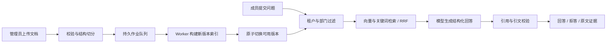

# 企业内部知识库智能问答平台

[在线界面](https://xiaoguos.github.io/ops-knowledge-rag/) · [部署指南](docs/deployment.md) · [架构说明](docs/architecture.md) · [运行截图说明](docs/screenshots/README.md)

浅色知识工作区：问答与原文证据分栏，资料按部门授权检索，管理员单独维护文档版本与成员权限。



当前截图说明页中的图片为此前界面版本的真实运行记录，不代表本次新版布局；新版截图将在浏览器实际运行验收后替换，不使用合成图代替。

面向企业内部文档的实际后端系统：文档导入与版本管理、后台语义索引、权限过滤、混合检索、模型回答与原文引用。生产入口不使用内置示例资料，也不提供浏览器模拟回答。

**交付状态：上线候选实现，尚待后端主机与真实模型环境验收。GitHub Pages 仅是客户端，不能代替后端部署。**

## 当前实现

- PostgreSQL + pgvector 512维 BGE 中文向量，PostgreSQL全文候选 + BM25评分 + RRF融合；当前密集检索为精确距离排序，不宣称已实现百万级 ANN 容量。
- PDF/DOCX/Markdown/TXT 解析，结构感知切分，异步索引；新版本完成后原子切换，失败保留旧可用版本，旧任务不能覆盖新版本。
- 服务端租户、角色、部门权限；管理员管理文档与成员，普通成员只能检索授权部门。
- 真实 OpenAI-compatible 模型接口。未配置/超时/错误时明确失败；引用 ID 与引文子串校验，不声称这种校验能证明结论语义正确。
- 会话与审计持久化，问答历史属于创建者。部门权限撤销后，相关历史回答不再返回原文。

## 运行和验证

见 [部署指南](docs/deployment.md)、[架构说明](docs/architecture.md) 与 [开发日志](docs/development-log.md)。

```bash
pip install ".[dev]"
APP_ENV=test pytest -q
```

配置 TEST_DATABASE_URL 后，同一组生产平台测试使用 PostgreSQL，而非 SQLite。CI 运行 PostgreSQL 集成测试、迁移、Docker构建和 API/Worker 就绪检查，成功后发布 web/。

## 目录与历史研究

app/main.py + app/production.py 是产品入口。app/service.py、app/store.py 与旧检索评估脚本是早期基线研究，不能用于生产启动；data/ 内样本不会自动导入产品。docs/ 的旧评估数据是阶段一实验，不是当前系统线上指标。

面试手册独立交付，不放在产品导航。没有真实模型质量评估和线上负载数据前，不填写89%准确率、17%召回提升或生产并发数字。
