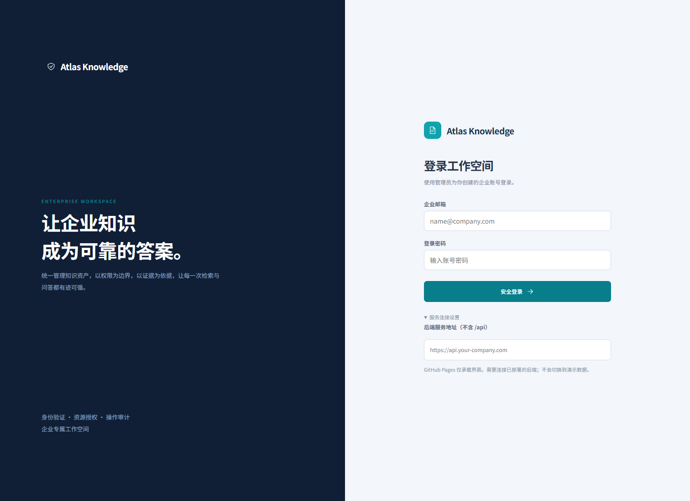
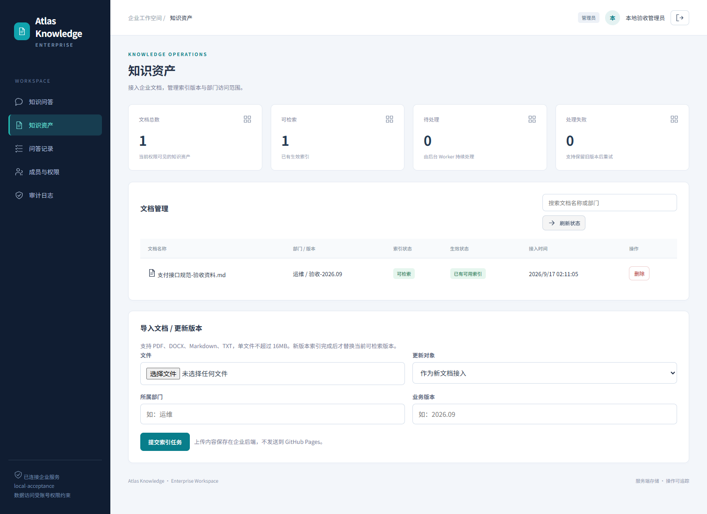

# 截图说明

- production-login.png：此前 GitHub Pages 登录界面的真实截图，早于本次中文品牌与浅色阅读布局调整。
- workspace.png：此前本地真实后端验收页面；账号与数据明确标识为验收用途，布局不是最新版。
- phase1-*：旧原型历史截图，不代表当前产品。

生成模型服务尚未配置，因此没有伪造已生成答案/报告的截图。完整截图集和浏览器验收记录独立交付给项目使用者。

## 历史运行记录

登录入口：

知识问答工作区：

新版截图计划覆盖：登录、知识问答、文档上传、异步索引完成、版本更新、问答原文核对、个人历史、成员权限、审计和手机端。模型成功回答必须在真实模型配置后实际生成才能截图。当前环境阻止浏览器子进程启动，因此新版截图尚未生成。
